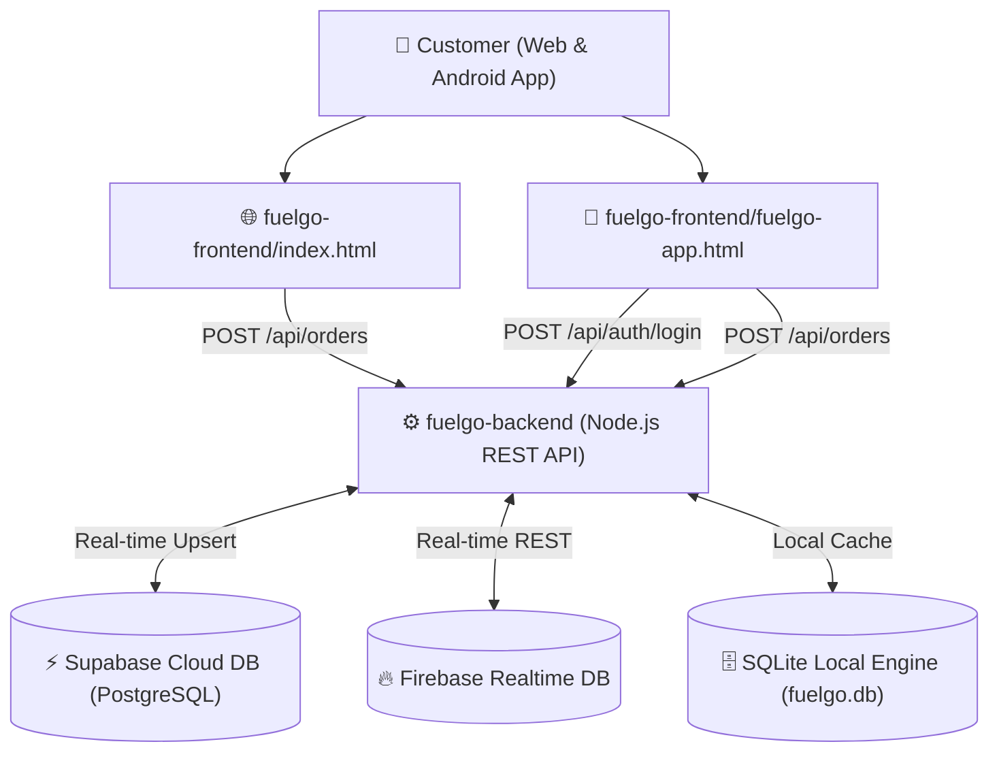

# ⛽ FuelGo — Doorstep Fuel & Energy Delivery Platform

[](https://github.com/Pawan2431/fuelgo/actions)
[](https://Pawan2431.github.io/fuelgo/)
[](https://Pawan2431.github.io/fuelgo/fuelgo-app.html)
[](https://feshnblvfdhjvgehklvd.supabase.co)

---

## 🌟 Executive Overview
**FuelGo** is a full-stack, enterprise-grade fuel & energy delivery platform providing on-demand delivery of **Petrol, Diesel, CNG, EV Charging, Premium Fuel, and LPG Cylinders** straight to customer locations (Vehicles, Fleets, Generators, and Estates).

The platform features:
1. **Desktop & Mobile Web Application**: Responsive landing page, interactive ordering engine, and live station discovery.
2. **Mobile Customer App (PWA & Native Android)**: Real-time order booking, live GPS driver delivery tracking, and station filtering.
3. **Multi-Database Hybrid Backend Engine**: RESTful Node.js / Express API backed by **Supabase Cloud (PostgreSQL)**, **Firebase Realtime Database**, and **SQLite Local Engine**.
4. **Appium & Selenium E2E Automation Framework**: 510 automated test cases with interactive HTML/Excel reporting pipelines.

---

## 📱 Quick Access Links & Live Endpoints

| Resource / App | Link / Endpoint | Description |
| :--- | :--- | :--- |
| 🌐 **Live Landing Web App** | [Pawan2431.github.io/fuelgo/](https://Pawan2431.github.io/fuelgo/) | Production landing page & web ordering engine |
| 📱 **Mobile Customer App** | [Pawan2431.github.io/fuelgo/fuelgo-app.html](https://Pawan2431.github.io/fuelgo/fuelgo-app.html) | PWA & Mobile app interface |
| 🗄️ **Backend API Index** | `http://localhost:3000/api` | RESTful API status & endpoint directory |
| ⚡ **Supabase Cloud Database** | `https://feshnblvfdhjvgehklvd.supabase.co` | PostgreSQL Cloud Database |
| 🔥 **Firebase Realtime DB** | `https://fuelgo-a8e7e-default-rtdb.firebaseio.com/` | Realtime Database Endpoint |
| 📊 **E2E Automation Report** | [Execution Report](https://Pawan2431.github.io/fuelgo/reports/latest/execution-report.html) | Interactive HTML Test Dashboard |
| 📦 **Android Release APK** | [Download FuelGo-Exact.apk](https://github.com/Pawan2431/fuelgo/raw/main/FuelGo-Exact.apk) | Production Android Package |

---

## 📁 Decoupled Project Structure

The project is structured into clear, independent **frontend** and **backend** subfolders for independent deployment:

```
FUELGO/
├── 🎨 fuelgo-frontend/     --> Standalone Web App & PWA (Deployable to Vercel/Netlify/GitHub Pages)
│   ├── index.html          --> Desktop & Web Landing Page
│   ├── fuelgo-app.html     --> Mobile Customer PWA Application
│   ├── manifest.json       --> PWA Application Manifest
│   ├── sw.js               --> PWA Service Worker Cache
│   ├── package.json        --> Frontend dependencies
│   └── README.md           --> Frontend Setup Documentation
│
├── ⚙️ fuelgo-backend/      --> Standalone REST API & Cloud Database Engine (Deployable to Render/Fly.io)
│   ├── server.js           --> Express.js HTTP Server & Endpoint Routing
│   ├── database.js         --> Supabase (PostgreSQL), Firebase RTDB & SQLite Connector
│   ├── routes/             --> API Route Modules (auth.js, orders.js, prices.js, stations.js)
│   ├── supabase_schema.sql --> Supabase SQL Setup Script
│   └── .env                --> Supabase API Keys & Environment Configuration
```

---

## 🏗️ Architecture & Component Overview



---

## ⚡ Backend REST API Reference

All API routes are mounted under `/api`:

### 1. Authentication Endpoints (`/api/auth`)
- `POST /api/auth/register`: Register new customer with email, phone, and hashed password.
- `POST /api/auth/login`: Authenticate customer credentials & issue 7-day JWT Token.

### 2. Fuel Prices Endpoint (`/api/prices`)
- `GET /api/prices`: Retrieve current fuel market rates:
  - **Petrol**: ₹94.72 / L
  - **Diesel**: ₹87.62 / L
  - **CNG**: ₹78.50 / kg
  - **EV**: ₹9.20 / kWh
  - **Premium**: ₹112.00 / L
  - **LPG**: ₹68.00 / kg

### 3. Gas Stations Endpoint (`/api/stations`)
- `GET /api/stations`: Retrieve open gas stations in Chennai / Chetipedu with ratings and GPS coordinates (Indian Oil, BPCL, HP, Shell, Tata Power EV, Adani Gas).

### 4. Orders & GPS Tracking Endpoints (`/api/orders`)
- `POST /api/orders`: Submit new fuel order with delivery address, lat/lng, fuel type, and quantity.
- `GET /api/orders`: Fetch customer order history.
- `PATCH /api/orders/:id/location`: Update delivery driver live GPS coordinates in real-time.

---

## 🧪 E2E Test Automation Pipeline

The repository includes a comprehensive Appium mobile & web automation engine located in `appium-mobile-tests/` and `automation/`:

- **510 Test Cases** across UI, API, Order Lifecycle, Payment Modes (GPay, PhonePe, Paytm, Cards, Cash), and Map Driver Tracking.
- **GitHub Actions Integration**: Executed automatically on every push via `.github/workflows/android-e2e.yml`.
- **Reports Generated**:
  - `execution-report.html` (Interactive dashboard)
  - `Automation_Test_Report.xlsx` (Excel workbook report)
  - `test-cases.json` & `execution-summary.md`

---

## 🚀 Running Locally

### 1. Start Backend Server & SQLite/Supabase/Firebase Services
```bash
cd fuelgo-backend
npm install
node server.js
```
*Server runs on `http://localhost:3000`*

### 2. Launch Front-End Web Application
Open [index.html](file:///c:/Users/pulla/OneDrive/FUELGO/index.html) or [fuelgo-app.html](file:///c:/Users/pulla/OneDrive/FUELGO/fuelgo-app.html) directly in any web browser, or serve via any static web server.

---

## 📄 License & Maintainer

- **Maintainer**: Pawan Teja ([@Pawan2431](https://github.com/Pawan2431))
- **Project Repository**: [github.com/Pawan2431/fuelgo](https://github.com/Pawan2431/fuelgo)
